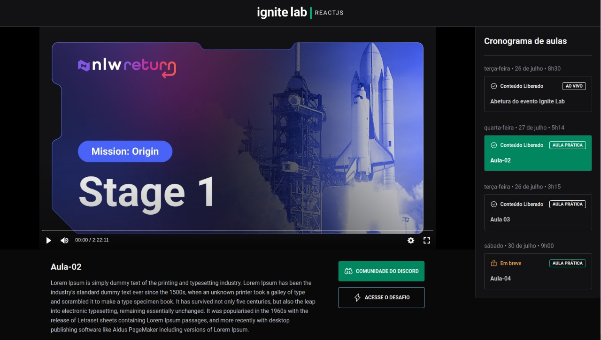

## EVENT PLATFORM

### Tecnologies used

 
  
      
  
  
  
  

## CHALLENGES DONE

- Resonsive for mobile devices

- Loading spinner while data fatching

## SETTINGS

**STEPS**

- Clone the project and `run npm i` to install all libs and then `run npm dev` to access the project on local port.

**or**

  <pre>npm i && npm run dev</pre>

*If you want check the projet in live*

Click [here](https://ignite-lab-vert-one.vercel.app/)

